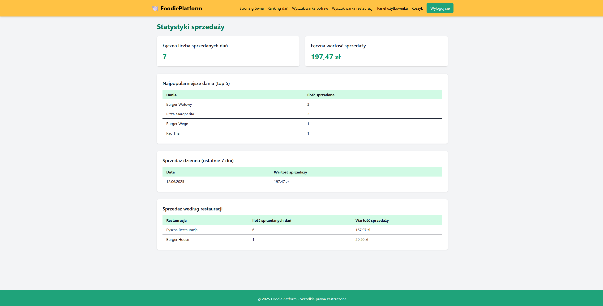

# Projekt AI1

[Repozytorium projektu](https://github.com/Hiltes/project-ai1)

[Tablica projektowa](https://github.com/users/Hiltes/projects/3)

---


### Temat projektu

Platforma do zamawiania jedzenia do domu

---

### Zespół X

| Profil | Rola |
| ------ | ------ |
| [Dariusz Szymanek](https://github.com/Hiltes) | lider zespołu |
| [Filip Ślemp](https://github.com/FilipSl3) | członek zespołu |
| [Jakub Róg](https://github.com/xkubax242) | członek zespołu |
| [Kacper Papiernik](https://github.com/LeNexusLe) | członek zespołu |

---


## Opis projektu

Projektowana aplikacja obejmuje swoim działaniem obsługę zamówień w ramach platformy do zamawiania jedzenia online. System umożliwia zarówno klientom końcowym dokonywanie zakupów, jak i administratorom zarządzanie zamówieniami i analizowanie danych sprzedażowych. Aplikacja obejmuje cyfrowe pośrednictwo pomiędzy użytkownikiem a restauracjami, zapewniając mechanizmy zakupowe, obliczanie kosztów dostawy, przechowywanie historii zamówień oraz obsługę panelu administracyjnego. System przewiduje dwa główne interfejsy: dla klienta końcowego oraz dla administratora platformy.

Dostępne funkcjonalności:

Panel Klienta
* Obsługa koszyka - mechanizm umożliwiający dodawanie, edytowanie i usuwanie produktów z koszyka zakupowego
* Dokonywanie zakupów - klient może przeglądać menu restauracji, dodawać produkty do koszyka
* Wyliczanie kosztów dostawy - w momencie składania zamówienia, system automatycznie oblicza koszt dostawy na podstawie wybranych restauracji
* Historia zakupów - klient może przeglądać historię swoich wcześniejszych oraz aktualnych zamówień

Panel Admina
* Statystyki sprzedaży - możliwość przeglądania danych statystycznych dotyczących sprzedaży, takich jak liczba zamówień, przychody, najczęściej wybierane produkty itp.
* Pełna obsługa CRUD zasobu zamówień - możliwość tworzenia, odczytu, edytowania i usuwania zamówień.

### Narzędzia i technologie
* technologia 1, wersja ...
* technologia 2, wersja ...
* ...
* środowisko 1, wersja ...
* środowisko 2, wersja ...
* ...

### Uruchomienie aplikacji

Napisać, co trzeba mieć zainstalowane (oraz inne potrzebne dodatkowe informacje).

```
Umieścić komendy z start.bat

```

Przykładowi użytkownicy aplikacji:
* administrator: jan@email.com 1234
* użytkownik: anna@email.com 1234
* ...
* ...

### Baza danych


## Widoki aplikacji 


*Koszyk*


*Historia zakupów*


*Statystyki sprzedaży*


*Zarządzanie zamówieniami*