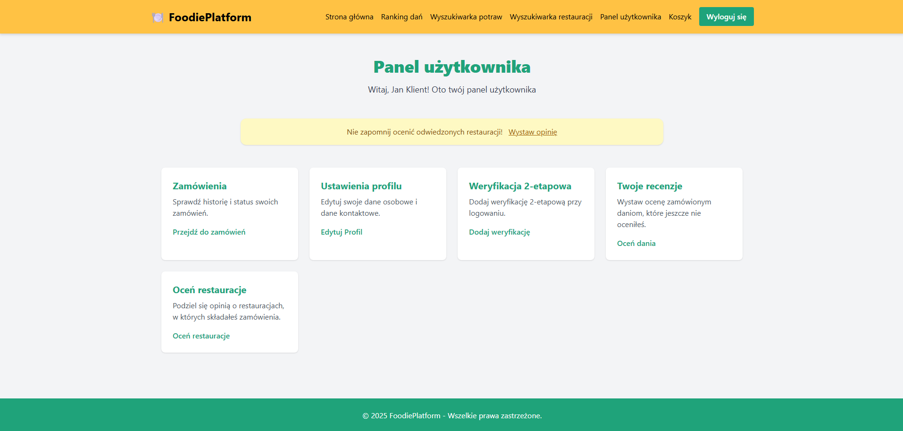
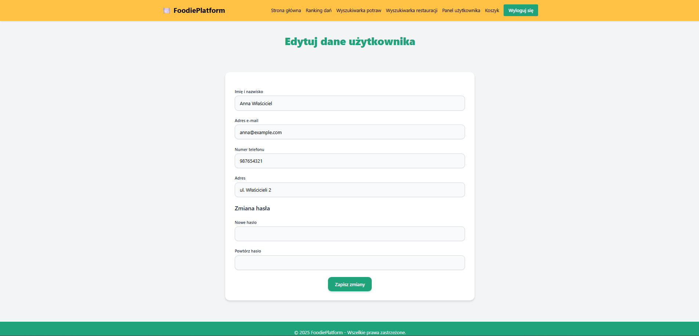

# Projekt AI1

[Repozytorium projektu](https://github.com/Hiltes/project-ai1)

[Tablica projektowa](https://github.com/users/Hiltes/projects/3)

---


### Temat projektu

Platforma do zamawiania jedzenia do domu

---

### Zespół G4

| Profil | Rola |
| ------ | ------ |
| [Dariusz Szymanek](https://github.com/Hiltes) | lider zespołu |
| [Filip Ślemp](https://github.com/FilipSl3) | członek zespołu |
| [Jakub Róg](https://github.com/xkubax242) | członek zespołu |
| [Kacper Papiernik](https://github.com/LeNexusLe) | członek zespołu |

---


## Opis projektu

Projektowana aplikacja obejmuje swoim działaniem obsługę zamówień w ramach platformy do zamawiania jedzenia online. System umożliwia zarówno klientom końcowym dokonywanie zakupów, jak i administratorom zarządzanie zamówieniami i analizowanie danych sprzedażowych. Aplikacja obejmuje cyfrowe pośrednictwo pomiędzy użytkownikiem a restauracjami, zapewniając mechanizmy zakupowe, obliczanie kosztów dostawy, przechowywanie historii zamówień oraz obsługę panelu administracyjnego. System przewiduje dwa główne interfejsy: dla klienta końcowego oraz dla administratora platformy.

Dostępne funkcjonalności:

Panel Klienta
* Obsługa koszyka - mechanizm umożliwiający dodawanie, edytowanie i usuwanie produktów z koszyka zakupowego
* Dokonywanie zakupów - klient może przeglądać menu restauracji, dodawać produkty do koszyka
* Wyliczanie kosztów dostawy - w momencie składania zamówienia, system automatycznie oblicza koszt dostawy na podstawie wybranych restauracji
* Historia zakupów - klient może przeglądać historię swoich wcześniejszych oraz aktualnych zamówień
* Przeglądanie dostępnych dań z różnych restauracji
* Wyświetlanie szczegółów dań z różnych restauracji
* Ranking najlepszych potraw z tego miesiąca
* Wystawianie opinii o daniach
* Przeglądanie dostępnych restauracji
* Wystawanie opinii o restauracjach
* Wyświetlanie informacji o restauracjach


Panel Admina
* Statystyki sprzedaży - możliwość przeglądania danych statystycznych dotyczących sprzedaży, takich jak liczba zamówień, przychody, najczęściej wybierane produkty itp.
* Pełna obsługa CRUD zasobu zamówień - możliwość tworzenia, odczytu, edytowania i usuwania zamówień.
* Pełna obsługa CRUD zasobu dań - możliwość tworzenia, odczytu, edytowania i usuwania zamówień.
* Pełna obsługa CRUD zasobu restauracji -  możliwość tworzenia, odczytu, edytowania i usuwania restauracji.
* Pełna obsługa CRUD zasobu użytkowników - możliwość tworzenia, odczytu, edytowania i usuwania użytkowników.
* Obsługa ról (admin, customer) – middleware + routing warunkowy.


Ogólne Funkcjonalności
* Logowanie i rejestracja użytkownika z walidacją danych.
* Obsługa resetu hasła z wykorzystaniem tokenu.
* Obsługa dwuetapowej weryfikacji TOTP (Google Authenticator).
* Możliwość zmiany hasła i zarządzania swoim profilem.
* Obsługa widoków błędów HTTP (403, 404, 419, 500)


Bezpieczeństwo aplikacji
* Ochrona przed brute-force (RateLimiter na logowanie)
* TOTP – dwuetapowa weryfikacja logowania
* Hasła szyfrowane (bcrypt)
* Walidacja i komunikaty błędów dostosowane do użytkownika
* Middleware – zabezpiecza dostęp do zasobów po zalogowaniu


# Reset hasła (komenda CLI)
```
php artisan password:reset janek@example.com
```

### Narzędzia i technologie
* Laravel 11 (backend, framework aplikacji)
* PHP 8.3
* Livewire Volt (komponenty frontendowe i interakcja)
* Tailwind CSS (stylowanie widoków)
* PostgreSQL
* spomky-labs/otphp (2FA – TOTP)

### Uruchomienie aplikacji

composer install
npm install

```
echo === Instalacja zaleznosci PHP ===
call composer install

echo === Instalacja zaleznosci JS ===
call npm install

echo === Tworzenie .env (jesli brak) ===
IF NOT EXIST .env (
    copy .env.example .env
)

echo === Generowanie APP_KEY ===
call php artisan key:generate

echo === Tworzenie dowiazania storage ===
call php artisan storage:link

echo === Migracja i seedy ===
call php artisan migrate:fresh --seed

echo === Uruchamianie backendu i frontend ===
call composer run dev

```

Przykładowi użytkownicy aplikacji:
* administrator: anna@example.com password
* użytkownik: janek@example.com password

### Baza danych


## Widoki aplikacji 


*Koszyk*


*Historia zakupów*


*Statystyki sprzedaży*


*Zarządzanie zamówieniami*


*Zarządzanie daniami*


*Przeglądarka dań*


*Ranking Najlepiej ocenianych dań*


*Wystawianie opinni o daniach*


*Wyświetlanie szczegółów wybranego dania*


*Wyświetlanie informacji o wybranej restauracji*


*Przeglądarka restauracji*


*Zarządzanie restauracjami*


*Wystawianie opinii o restauracji*


*Wystawianie opinii o restauracji*


  
*Formularz logowania z walidacją i komunikatami błędów*

  
*Formularz rejestracji użytkownika z walidacją danych*

  
*Formularz resetowania hasła z obsługą tokenów i walidacji*

  
*Panel administratora z dostępem do zarządzania zasobami*

  
*Panel klienta z dostępem do ustawień i historii zamówień*

  
*Lista użytkowników z opcją edycji i usuwania (CRUD)*

  
*Formularz tworzenia nowego użytkownika (CRUD – Create)*

  
*Formularz edycji danych użytkownika (CRUD – Update)*

  
*Widok szczegółów użytkownika (CRUD – Read)*

  
*Widok weryfikacji kodu TOTP (Google Authenticator)*

  
*Dedykowany widok błędu HTTP – przykład 404*
